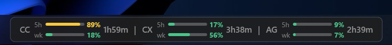

# AI Usage Monitor

A lightweight, TrafficMonitor-style Windows 11 taskbar widget that docks next to your system tray icons, showing your real-time usage and rate limits for **Claude Code (CC)**, **Codex (CX)**, and **Antigravity CLI (AG)**.

<p align="center">
  
</p>


## Features

- **Seamless Multi-Monitor Taskbar Integration**:
  - Docks over the Windows taskbar next to the tray icons (`TrayNotifyWnd`).
  - Automatically adjusts position, scale, and layout every 2 seconds to adapt to taskbar size, resolution, and DPI changes.
  - **Multi-Monitor Support**: Select which monitor/taskbar to dock on (Primary or any Secondary taskbar) via the context menu.
  - **Visibility Toggling**: Hide the main bar from the desktop using "Hide bar" and show it again via the system tray context menu.
- **Interactive Controls**:
  - **Drag Repositioning**: Click and drag horizontally to place the widget exactly where you want it (position is saved to config).
  - **Context Menu Options**: Toggle individual segments, manually refresh, trigger logins, switch accounts, select monitor, configure Windows autostart, or exit.
  - **System Tray Icon**: A persistent tray icon supporting refreshing, showing/hiding the bar, monitor selection, account selection, and application exit.
- **Dual-Window Metrics**: Visualizes usage for two critical windows (e.g., short-term 5-hour and weekly) using TrafficMonitor-style dual-row mini bars.
- **Remaining Quota Mode**: Toggles display between **% used** and **% remaining** (quota left) via the context menu or `ShowRemaining` config setting. Tooltips and detail views automatically adapt to display "left" or "free" values.
- **Configurable Color Coding**: Automatically color-codes bars based on utilization limits (thresholds configurable in `config.json` via `YellowAtPercent` / `RedAtPercent`):
  - 🟢 **Green**: `< 70%` utilization (default)
  - 🟡 **Amber**: `70% – 90%` utilization (default)
  - 🔴 **Red**: `> 90%` utilization (default)


---

## Supported Tools & Data Sources

| Tool | Primary Source | Fallback / Offline Source |
| :--- | :--- | :--- |
| **Claude Code (CC)** | Live OAuth utilization endpoint (`/api/oauth/usage`). Fully supports widget-based OAuth sign-in and token auto-refresh. | Scans local transcript JSONL files in `~/.claude/projects/` to calculate input/output token usage over the last 5 hours. |
| **Codex (CX)** | Live backend API (`/backend-api/wham/usage`) using the OAuth token stored by Codex in `~/.codex/auth.json`. | Parses rate limit payloads from the tail of the newest local rollout session files in `~/.codex/sessions/`. |
| **Antigravity (AG)** | Querying the local `language_server_windows_x64.exe` instance. CSRF token and port are automatically discovered via WMI and TCP state. | Counts the number of active conversation database files (`*.db`) modified today in `~/.gemini/antigravity-cli/conversations/`. |

---

## Multi-Account Support (Codex)

You can manage and switch between multiple Codex accounts seamlessly via the widget:
- Stores separate account sessions in `%APPDATA%\AIUsageMonitor\codex/` and swaps active tokens in `~/.codex/auth.json`.
- Automatically backs up your initial base session as `auth_master.json`.
- Syncs token refreshes back to store files before switching, preventing token expiration or session loss.
- **Account Management UI**: Right-click → **Codex account** → **Configure accounts...** opens a dedicated window where you can list all profiles, asynchronously fetch their real-time usage (primary & weekly) with countdown timers, rename aliases, add new accounts (triggers `codex login` flow), or remove them.

---

## Build and Run

### Prerequisites
- **.NET 10 SDK** (to build)
- **.NET 10 Desktop Runtime** (to run the executable)

### Building
Open the solution `AIUsageMonitor.sln` in Visual Studio 2022, or build via the command line:

```powershell
# Build in Debug mode
dotnet build -c Debug

# Publish a single-file Release executable
dotnet publish AIUsageMonitor\AIUsageMonitor.csproj -c Release
```

The published artifact will be located at:
`publish\AIUsageMonitor.exe`

### Configuration Files
- **App Data**: `%APPDATA%\AIUsageMonitor\`
- **Settings**: `config.json` (controls refresh interval, visual positioning offsets, monitor selection, bar visibility, color thresholds, remaining quota toggle, and enabled segments).
- **OAuth Session**: `claude_oauth.json` (stores access/refresh tokens securely).
- **Codex Accounts Store**: `codex/` (contains credentials for all configured Codex accounts).
- **Debug Logs**: `claude_api_debug.log` (tracks Claude API requests and token rotation states).
