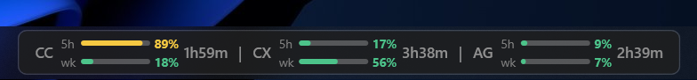
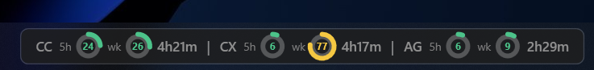
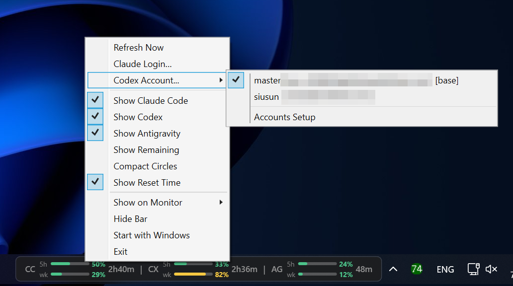

# AI Usage Monitor

[](https://microsoft.com/windows)
[](https://dotnet.microsoft.com/)
[](https://github.com/siusunhub/aiusagemonitor)
[](LICENSE)

A lightweight, TrafficMonitor-style Windows 11 taskbar widget that docks next to your system tray icons, showing real-time usage and rate limits for **Claude Code (CC)**, **Codex (CX)**, and **Antigravity CLI (AG)**.

<p align="center">
  <br>
  
</p>

---

## Features

- **Seamless Taskbar Integration**:
  - Docks neatly over the Windows taskbar next to the tray icons (`TrayNotifyWnd`).
  - Corrects Windows 11 taskbar bounding heights to ensure pixel-perfect vertical alignment with the visible bar.
  - Automatically adapts to resolution changes, taskbar scaling, and per-monitor DPI settings.
  - **Multi-Monitor Support**: Select which monitor/taskbar to dock on (Primary or any Secondary taskbar) via the context menu.
- **Smart System Tray Icon & Visibility Toggling**:
  - **Auto-Hiding Tray Icon**: When the status bar is visible on the desktop, the tray icon is hidden to keep your system tray clean. When the status bar is hidden via "Hide Bar", the tray icon automatically appears.
  - **Quick Restore**: Double-clicking the tray icon immediately restores the status bar.
- **Context Menus & Version Display**:
  - Displays the current application version (e.g. `AI Usage Monitor v0.11`) at the very top of both the status bar and tray right-click menus as a reference header.
  - Quick access to refresh metrics, sign into Claude Code, switch Codex accounts, toggle individual tool segments, change display modes, and configure autostart.
- **Display Modes & Customization**:
  - **Dual-Row Mini Bars**: TrafficMonitor-style dual bars for short-term (5-hour) and long-term (weekly) quotas.
  - **Short Usage Bar Mode**: Shrink mini usage bar tracks to 40% width via right-click menu, optimizing space on crowded taskbars.
  - **Compact Circles**: Minimalist circular progress rings showing quota status with center percentage readouts.
- **Quota Modes & Countdown Timers**:
  - **Remaining Quota Mode**: Toggle display between **% used** and **% remaining** (quota left).
  - **Show Reset Time**: Displays a real-time countdown to the next quota reset.
  - **Intelligent Polling Optimization**: Automatically pauses background API polling when 100% quota is reached until right before the reset time, saving unnecessary network requests.
- **Streamlined Authentication**:
  - **Double-Click Quick Sign-In**: Double-clicking the widget immediately launches the Claude Login dialog or Codex Accounts window whenever credentials need attention.
  - **Copy Login URL**: One-click button in Claude and Codex login dialogs to copy authorization URLs to clipboard for easy sign-in across browsers.
- **Rich Hover Tooltips**:
  - Hovering any tool segment reveals detailed hover cards with exact reset timestamps, active plans/accounts, and detailed window statuses.
- **Visual Status & Color Coding**:
  - 🟢 **Green**: `< 70%` utilization (default)
  - 🟡 **Amber**: `70% – 90%` utilization (default)
  - 🔴 **Red**: `> 90%` utilization (default)
  - 🔘 **Muted Gray**: Offline or estimated telemetry (`~`) is visually distinguished from live validated API metrics.

---

## Supported Tools & Data Sources

| Tool | Primary Source | Fallback / Offline Source |
| :--- | :--- | :--- |
| **Claude Code (CC)** | Live OAuth utilization endpoint (`/api/oauth/usage`). Fully supports widget-based OAuth sign-in and token auto-refresh. | Scans local transcript JSONL files in `~/.claude/projects/` to calculate input/output token usage over the last 5 hours. |
| **Codex (CX)** | Live backend API (`/backend-api/wham/usage`) using the OAuth token stored by Codex in `~/.codex/auth.json`. | Parses rate limit payloads from the tail of the newest local rollout session files in `~/.codex/sessions/`. |
| **Antigravity (AG)** | Querying the local `language_server_windows_x64.exe` instance. CSRF token and port are automatically discovered via WMI and TCP state. | Counts active conversation database files (`*.db`) modified today in `~/.gemini/antigravity-cli/conversations/`. |

---

## Multi-Account Support (Codex)

<p align="center">
  
</p>

Manage and switch between multiple Codex accounts directly from the widget:
- Stores separate account sessions in `%APPDATA%\AIUsageMonitor\codex/` and hot-swaps active credentials in `~/.codex/auth.json`.
- Backs up your base session as `auth_master.json`.
- **Account Management UI** (Right-click → **Codex Account...** → **Accounts Setup**):
  - List all saved accounts with live primary & weekly quota usage and countdowns.
  - **Add Account**: Trigger `codex login` flow to register new profiles.
  - **Re-login (`↻ Re-login`)**: Refresh expired sessions in-place while retaining custom aliases.
  - **Set as Base (`Set as base`)**: Promote any profile to become the primary master account.
  - Rename custom aliases and delete unused accounts.

---

## Build and Run

### Prerequisites
- **.NET 10 SDK** (to build)
- **.NET 10 Desktop Runtime** (to run the executable)

### Building
Open `AIUsageMonitor.sln` in Visual Studio, or build via PowerShell:

```powershell
# Build in Debug mode
dotnet build -c Debug

# Publish a single-file Release executable
dotnet publish AIUsageMonitor\AIUsageMonitor.csproj -c Release
```

The published standalone executable will be located at:
`publish\AIUsageMonitor.exe`

### Configuration Files
- **App Data Folder**: `%APPDATA%\AIUsageMonitor\`
- **Settings (`config.json`)**: Controls refresh interval, visual positioning offsets, monitor selection, bar visibility, color thresholds, remaining quota toggle, and enabled segments.
- **OAuth Session (`claude_oauth.json`)**: Stores Claude access and refresh tokens.
- **Codex Store (`codex/`)**: Contains session data for configured Codex accounts.
- **Debug Logs (`claude_api_debug.log`)**: Diagnostic logging (enabled via `EnableDebugLog = true` in [App.xaml.cs](file:///c:/Users/Jacky/OneDrive/github-project/aiusagemonitor/AIUsageMonitor/App.xaml.cs)).
